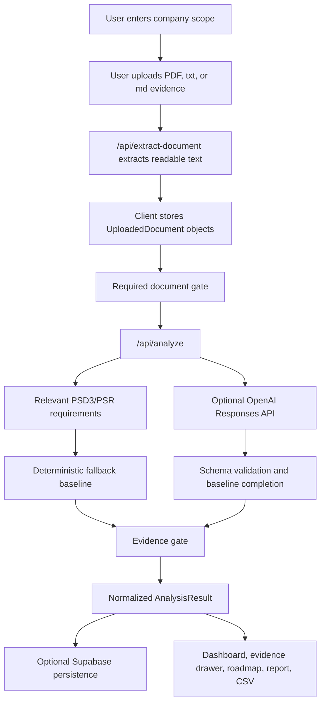

# Technical Architecture

## Overview

CompliancePilot is a Next.js App Router application. The UI is implemented in `app/page.tsx`, server endpoints live under `app/api`, and the analysis domain logic lives in `data` and `lib`.

The architecture is intentionally resilient for demos:

- OpenAI analysis is optional.
- Deterministic fallback analysis is always available.
- Final matrix rows are normalized by a separate evidence gate.
- API inputs and outputs are validated with Zod schemas.
- Supabase persistence is optional and non-blocking from the user's perspective.

## Runtime Shape



## Frontend

`app/page.tsx` is a client component with a guided workflow:

- `landing`: product entry screen.
- `scope`: company profile and service selection.
- `documents`: upload and required-evidence check.
- `processing`: staged progress UI.
- `results`: metrics, matrix, diagnostics, roadmap, report preview, and CSV export.

The client stores uploaded documents as:

```ts
type UploadedDocument = {
  name: string;
  type: string;
  content: string;
};
```

The client calls:

- `POST /api/extract-document` for each uploaded file.
- `POST /api/analyze` once the company profile and required documents are ready.

## Requirement Base

The regulatory requirement base is defined in `data/psd3-psr-requirements.ts`.

Each requirement includes:

- ID.
- Domain.
- Title and summary.
- Expected evidence.
- Impact areas.
- Priority.
- Relevant company types or service triggers.
- Regulatory source instrument, reference, and URL.

Scope filtering lives in `lib/requirement-scope.ts`:

- `getRelevantRequirements` selects applicable rows for the company profile.
- `inferServicesFromDocuments` identifies services mentioned in uploaded documents.
- `buildScopeWarnings` warns when documents mention unselected services.

## Required Documents

Required document rules live in `data/document-requirements.ts`.

Before analysis, the app checks whether uploaded documents satisfy required evidence categories for the selected company type and services. Missing required documents return a `400` from `/api/analyze` and are also surfaced in the UI before the API call.

## Analysis Orchestration

`app/api/analyze/route.ts` orchestrates the server-side flow:

1. Parse and validate the request with `analyzeRequestSchema`.
2. Check required documents.
3. Build a deterministic fallback baseline with `runFallbackAnalysis`.
4. Attempt OpenAI analysis with `analyzeWithOpenAI`.
5. If OpenAI succeeds, complete any missing rows from the fallback baseline.
6. Apply the deterministic evidence gate.
7. Validate the final result with `analysisResultSchema`.
8. If validation fails, return a gated fallback result.
9. Attempt Supabase persistence.
10. Return the normalized result with diagnostics.

## OpenAI Path

`lib/ai-analyzer.ts` calls the OpenAI Responses API when `OPENAI_API_KEY` is configured.

The prompt requires strict JSON and the result is validated against the local schema. The app never trusts the model output directly. If the response is missing, invalid, times out, or fails schema validation, the fallback path is used.

Config:

- `OPENAI_API_KEY`: enables OpenAI analysis.
- `OPENAI_MODEL`: defaults to `gpt-5.4-mini`.
- `OPENAI_REASONING_EFFORT`: defaults to `none`.

## Fallback Path

`lib/fallback-analyzer.ts` provides deterministic keyword analysis.

It:

- Searches uploaded documents for requirement-specific keyword rules.
- Assigns initial statuses.
- Creates missing-evidence lists.
- Builds roadmap candidates.
- Creates a run ID and summary.

This keeps the app usable without external model access and gives regression tests a stable base.

## Evidence Gate

`lib/evidence-gate.ts` is the final authority over matrix status.

It prevents weak evidence from being overstated by:

- Separating demo placeholders, expected-evidence checklists, policy intent, procedures, design specs, and operational artifacts.
- Ignoring negative evidence contexts such as "missing", "not provided", or "contains no evidence".
- Requiring operational artifacts for `Covered`.
- Downgrading weaker evidence to `Partially covered`.
- Rebuilding the summary and roadmap from gated results.

## Persistence

`lib/persistence.ts` writes to Supabase only when credentials are available.

Required server env vars:

- `SUPABASE_URL` or `NEXT_PUBLIC_SUPABASE_URL`.
- `SUPABASE_SERVICE_ROLE_KEY`.

Tables are defined in `supabase/migrations/20260425_regpilot_psd3.sql`:

- `analysis_runs`
- `analysis_documents`
- `evidence_matrix_items`
- `roadmap_tasks`

Persistence failures are captured in diagnostics and do not prevent the API from returning an analysis result.

## Validation And Types

Core types live in `lib/types.ts`. Runtime validation lives in `lib/schemas.ts`.

Important contracts:

- `CompanyProfile`
- `UploadedDocument`
- `EvidenceMatrixItem`
- `RoadmapTask`
- `AnalysisResult`
- `AnalysisDiagnostics`

The app validates both incoming requests and final analysis results before returning data to the client.
